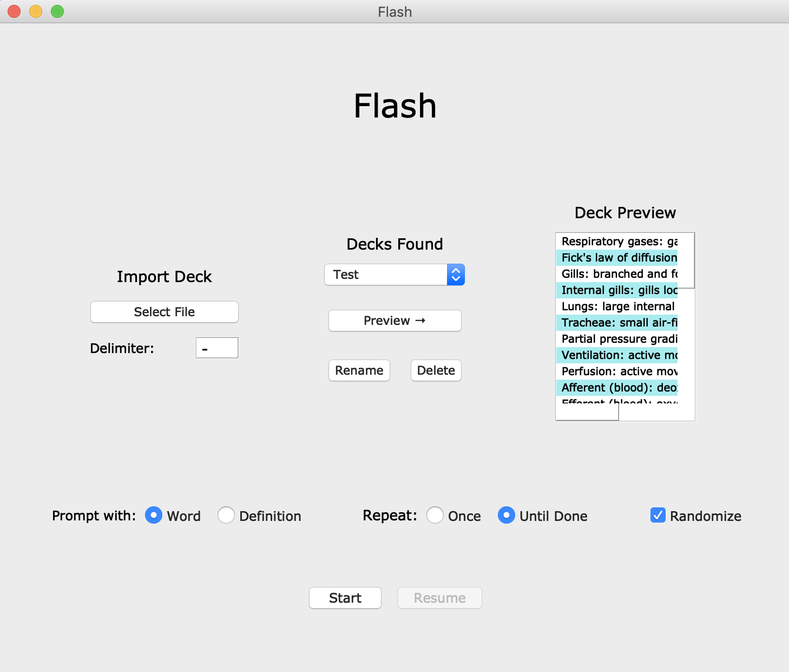

Flash (Flashcard Viewing Application)
------------------------------------

A basic flashcard application built with the Qt Design Framework and Python. Recently upgraded to Python 3.6 and Qt5.

Below is a screenshot of the load screen. Design is a work in progress.

The overall 

package: a bash script to build script and UIs into mac application

KNOWN BUGS/SHORTCOMINGS:

 [X] directory issues with pressing "import"
 
 [ ] better graphic design
 
 [ ] ability to write ignored comments in text file
 
 [ ] reverse testing (show definition, require term)
 
 [ ] pausing and resuming capabilities
 
 [ ] done page with stats
 
 [ ] deck naming box goes blank issue
 
 [X] timer
 
 [ ] support for rich text
 
 [ ] recognize all dashes as delimiter?
 
 [ ] text overflows on sides of card when no spaces present
 
 [ ] make it possible (and look good) to go full screen
 
 [ ] handle keyboard shortcuts (Q for quit, L for load, etc)
 
 [ ] print to PDF option, where printable template is generated

