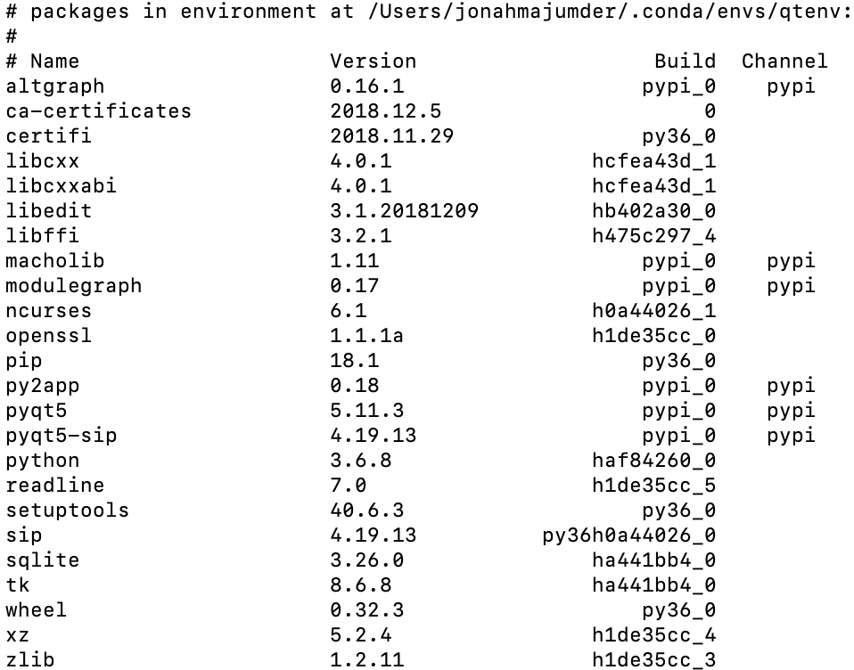

# Flash: macOS Flashcard Viewing Application

A basic macOS flashcard application built with the Qt Design Framework and Python. The application allows the user to select text files containing vocabulary words/phrases and associated definitions. This file is parsed, and the application allows for user-friendly self-testing and organization of flashcard "decks." Project was recently upgraded to Python 3.6 and Qt5.

Here is what the "load screen" currently looks like.

The major components of the project are:
* Qt UI files (created and edited in the "[Qt Creator](https://wiki.qt.io/Qt_Creator)" desktop application)
* Python code to reference/modify UI elements and run the application
* The [py2app](https://py2app.readthedocs.io/en/latest/#) utility, allowing for bundling of python code into standalone Mac apps

## FEATURES AND IMPROVEMENTS I HOPE TO IMPLEMENT
- [ ] better graphic design
- [ ] ability to write ignored comments in text file
- [ ] pictures associated with vocab, and the ability to prompt with them
- [X] reverse testing (show definition, require term)
- [ ] pausing and resuming capabilities, while testing
- [ ] done page with stats, maybe saved results?
- [X] timer
- [ ] support for rich text (making conversion to app-friendly txt file easier)
- [ ] make full screen mode look good
- [X] handle keyboard shortcuts (Q for quit, L for load, etc)
- [ ] print to PDF option, where printable template is generated

## KNOWN BUGS
- [ ] directory issues with pressing "import"-- where should it land you??
- [X] deck naming box "goes blank" issue (multiline issue)
- [X] deck names obscured in choice combo box (was related to multiline issue)
- [ ] recognize all dashes as delimiter?
- [ ] text overflows on sides of card when no spaces present
- [ ] flashcard text size should be based on whether it is a word or definition, not "front" or "back"

### Dependencies:

I use a designated Anaconda virtual environment to build and run this program. The following is the result of a `conda list` command, displaying installed nonstandard packages:

But installation of all of these packages was the result of just 3 conda (or pip) `install` commands:
* pip
* pyqt5
* py2app
* sip

And anaconda should handle the identification and installation of everything else.